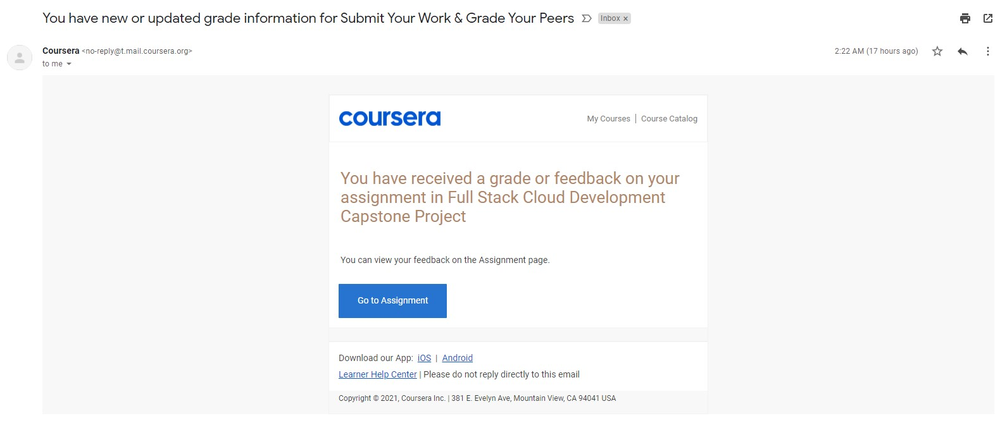
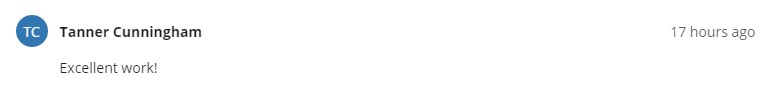
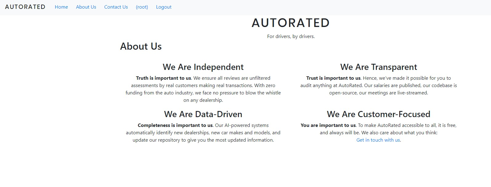
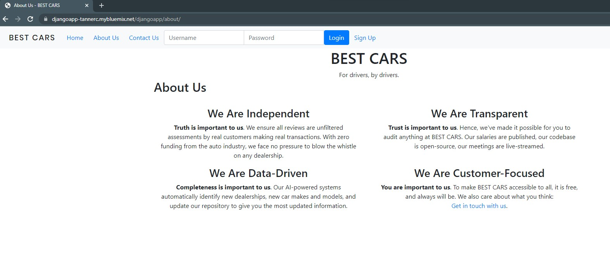
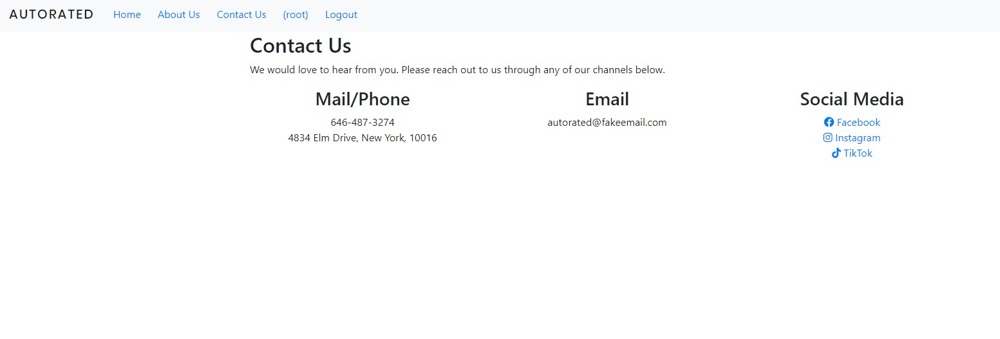
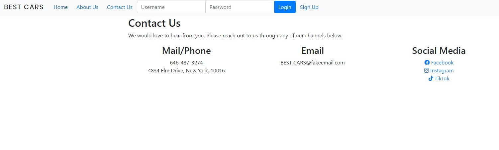
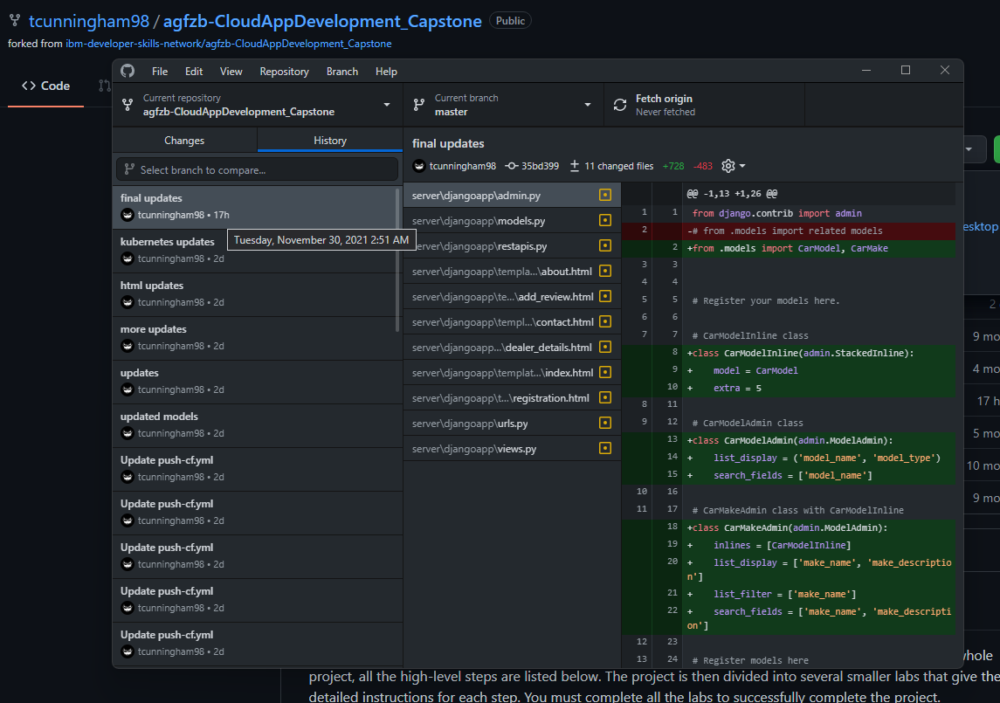
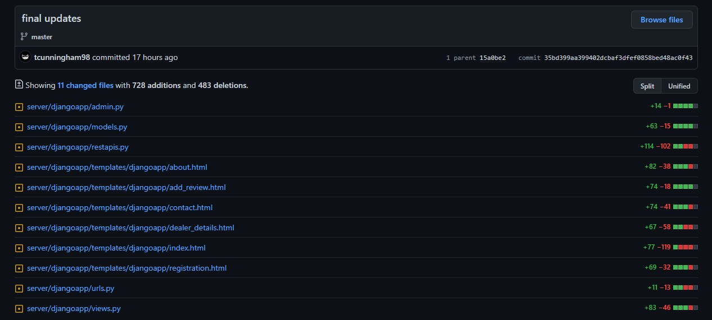

# Plagiarism Report
This document details an act of blatant plagiarism by another course participant for the Full Stack Cloud Development capstone project.

## Sequence of Events

### 1. My Submission
I submitted my capstone project in the early morning (GMT+8) on 30 Nov 2021. The style of the site was almost identical to what's available on [the site now](https://chrischow.mybluemix.net/djangoapp), less some errors in loading my custom CSS file.

### 2. Grading by User
I received an email notification that my assignment was graded at 2:22 AM on 30 Nov 2021. Upon checking Coursera, I identified the grader as **Tanner Cunningham**. See the screenshots below.

### 3. Discovery of Plagiarised Content
Later that evening, I proceeded to review other users' submissions and found Cunningham's submission. I was appalled to see that he had copied my work and submitted it as his own. He had not even bothered to change the content or fix the styling errors. I flagged the submission for plagiarism, and it was taken offline.

To check if the plagiariser was indeed leeching off the services I created in IBM Cloud (Cloud Functions API and Natural Language Understanding (NLU)), I turned off my API and NLU services, and his app failed.

### 4. Continued Plagiarism
The following day (1 Dec 2021), the plagiariser simply switched his Cloud Functions API URLs to yet another user's API URLs:

- Victim of plagiarism: [Submission](https://www.coursera.org/learn/ibm-cloud-native-full-stack-development-capstone/peer/QgVg5/submit-your-work-grade-your-peers/review/IuJvyFEZEeyIxA7f-ebEew) (accessible to course admins and participants only)
- Plagiariser's `views.py` file: [Link](https://github.com/tcunningham98/agfzb-CloudAppDevelopment_Capstone/blob/461b61c13a11adecfe224146470134a7e09bfb81/server/djangoapp/views.py)

My About page:

Plagiariser's About page:

My Contact page:

Plagiariser's Contact page:

## Investigation
The identical work could not be coincidence. Hence, I collected evidence that the work was copied. I cloned Cunningham's GitHub repository and found a massive commit to the repository shortly after my assignment was graded. At 2:51 AM, changes to five of the most essential Python scripts for the Django app and all the HTML view templates were committed.

For a more detailed inspection, you can compare the two repositories at the links below:

- My repository at the time of submission: [link](https://github.com/chrischow/agfzb-CloudAppDevelopment_Capstone/tree/15cc54554302734ea16cbbc30935da5480c8260a)
- Plagiariser's repository at the time of his first submission: [link](https://github.com/tcunningham98/agfzb-CloudAppDevelopment_Capstone/tree/35bd399aa399402dcbaf3dfef0858bed48ac0f43)

You'll find that:

- The URLs for the API I created as part of the project were used in the plagiariser's Django views code in `views.py`. For context, learners are supposed to have created their own API on IBM Cloud.
- The Natural Language Understanding service I created was used in the plagiariser's Django REST API code in `restapis.py`. I made the mistake of hard coding the API key (don't worry, it's disabled now).
- The Django models in `models.py` became identical to mine.

